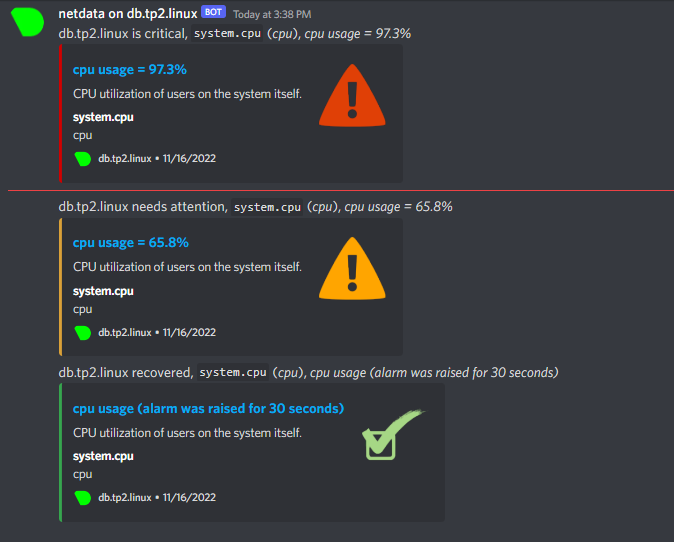

# TP3 : Amélioration de la solution NextCloud - Maxim Doublait B2B

## Module 5 : Monitoring

### Installations

``` 
[max@db ~]$ sudo dnf update
[max@db ~]$ sudo dnf install epel-release -y
Complete!
[max@db ~]$ sudo dnf install wget
Complete!
[max@db ~]$ wget -O /tmp/netdata-kickstart.sh https://my-netdata.io/kickstart.sh && sh /tmp/netdata-kickstart.sh
```

### Configuration de Netdata
```
[max@db ~]$ sudo systemctl start netdata
[max@db ~]$ sudo systemctl enable netdata
[max@db ~]$ sudo systemctl status netdata
● netdata.service - Real time performance monitoring
     Loaded: loaded (/usr/lib/systemd/system/netdata.service; enabled; vendor preset: disable>
     Active: active (running) since Wed 2022-11-16 00:29:13 CET; 2min 57s ago
```

```
PS C:\Users\mdoub\Desktop> curl 10.102.1.12:19999


StatusCode        : 200
StatusDescription : OK
Content           : <!doctype html><html lang="en"><head><title>netdata dashboard</title><meta name="application-name" content="netdata"><meta
                    http-equiv="Content-Type" content="text/html; charset=utf-8"/><meta charset="...
``` 

```
[max@db ~]$ sudo ss -alpnt | grep netdata
LISTEN 0      4096       127.0.0.1:8125       0.0.0.0:*    users:(("netdata",pid=46007,fd=55))
LISTEN 0      4096         0.0.0.0:19999      0.0.0.0:*    users:(("netdata",pid=46007,fd=6))
LISTEN 0      4096           [::1]:8125          [::]:*    users:(("netdata",pid=46007,fd=34))
LISTEN 0      4096            [::]:19999         [::]:*    users:(("netdata",pid=46007,fd=7))
``` 

```
[max@db ~]$ sudo nano /etc/netdata/health_alarm_notify.conf
  [1/1]                          health_alarm_notify.conf
###############################################################################
# sending discord notifications

# note: multiple recipients can be given like this:
#                  "CHANNEL1 CHANNEL2 ..."

# enable/disable sending discord notifications
SEND_DISCORD="YES"

# Create a webhook by following the official documentation -
# https://support.discordapp.com/hc/en-us/articles/228383668-Intro-to-Webhooks
DISCORD_WEBHOOK_URL="https://discord.com/api/webhooks/1043125556461436988/lJPsBvM737nb7J4J2HFw4A6YanJ05g43Qjj2p4HSjOtSVjcGWN_pUGW7rmwZl0Xic4UK"

# if a role's recipients are not configured, a notification will be send to
# this discord channel (empty = do not send a notification for unconfigured
# roles):
DEFAULT_RECIPIENT_DISCORD="general"
```

```
[max@db ~]$ sudo nano /etc/netdata/health.d/cpu_usage.conf
alarm: cpu_usage
on: system.cpu
lookup: average -3s percentage foreach user,system
units: %
every: 10s
warn: $this > 50
crit: $this > 80
info: CPU utilization of users on the system itself.
```

```
[max@db ~]$ sudo systemctl restart netdata
``` 

```
[max@db ~]$ sudo dnf install stress-ng
Installed:
  Judy-1.0.5-28.el9.x86_64  lksctp-tools-1.0.19-1.el9.x86_64  stress-ng-0.13.10-1.el9.x86_64

Complete!
``` 
### Test
```
[max@db ~]$ stress-ng -c 10 -l 60
stress-ng: info:  [47912] defaulting to a 86400 second (1 day, 0.00 secs) run per stressor
stress-ng: info:  [47912] dispatching hogs: 10 cpu
stress-ng: info:  [47912] successful run completed in 24.22s
```


